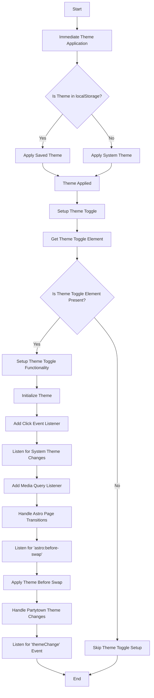

# Theme Toggle Script Explanation

This Mermaid diagram illustrates the flow and key components of the `theme-toggle.js` script:

## Debugging Tips

1. **Local Storage**: Use the browser's developer tools to inspect localStorage. Check if the theme is correctly saved and retrieved. You can manually set the theme in localStorage to test different scenarios.

2. **DOM Manipulation**: Use the browser's element inspector to verify that the 'dark' class is correctly toggled on the `document.documentElement`. You can add console logs before and after the toggle to confirm the operation.

3. **Event Listeners**: Ensure all event listeners are attached correctly. You can add console logs within the event listener functions to confirm they are triggered. For the 'themeChange' event, check if Partytown is correctly receiving and handling the event.

4. **Media Query**: Test the media query by changing your system's theme preference and observing if the script correctly responds to these changes. You can also manually trigger the media query change event in the console to test the functionality.
